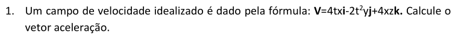
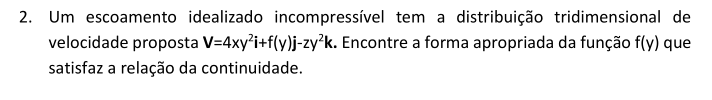
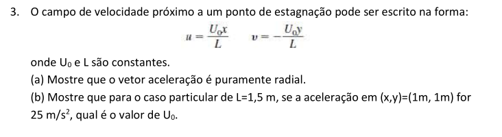
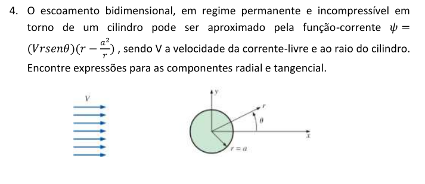
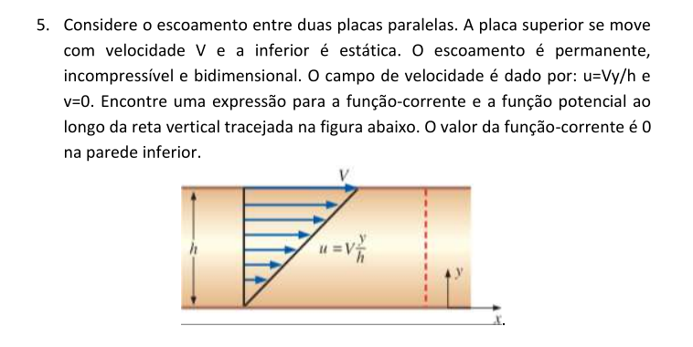
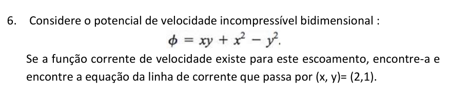
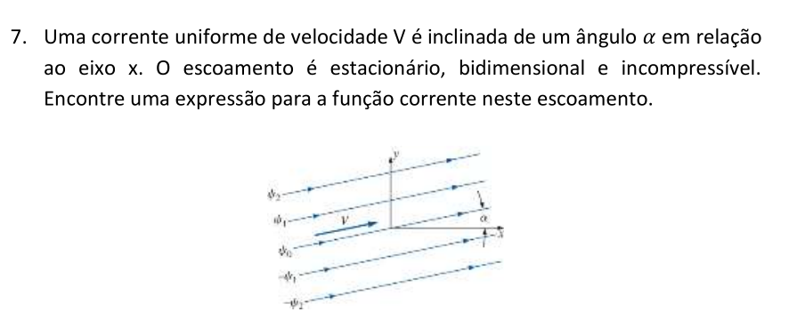

## Resolução primeira lista de exercícios

Author: Felipe J. O. Ribeiro (11711EAR012)

### 1 - primeira questão

- Temos a equação da velocidade:
$\vec{V} = 4tx \vec{i} - 2t^2y \vec{j} + 4xz \vec{k}$

Separando as componentes:

$u =4tx$

$v = - 2t^2y$

$w = 4xz$

- Para calcular a aceleração fazemos a derivada total:
$
    \vec{A} = \frac{D \vec{V}}{D t} = \frac{\partial \vec{V}}{\partial t} + u \frac{\partial \vec{V}}{\partial x} + v \frac{\partial \vec{V}}{\partial y} + w \frac{\partial \vec{V}}{\partial z}   
$

Separando as componentes:

$A_x = \frac{\partial u}{\partial t} + u \frac{\partial u}{\partial x} + v \frac{\partial u}{\partial y} + w \frac{\partial u}{\partial z}$

$A_y = \frac{\partial v}{\partial t} + u \frac{\partial v}{\partial x} + v \frac{\partial v}{\partial y} + w \frac{\partial v}{\partial z}$

$A_z = \frac{\partial w}{\partial t} + u \frac{\partial w}{\partial x} + v \frac{\partial w}{\partial y} + w \frac{\partial w}{\partial z}$

Onde observamos o termo da velocidade local no primeiro termo após a igualdade e os termos convectivos adiante.

$
A_x = 4x + u 4 t + v 0 + w 0 = 4 (x + ut) = 4(x + 4tx t) = 4x (1 + 4t^2)
$

$
A_y = -4ty + u 0 - 2 v t^2 + w 0 = -2t (2y + vt) = -2t (2y - 2t^3y) = -4ty(1 - t^3) 
$

$
A_z = 0 + u 4z + v 0 + w 4x = 4 (uz + wx) = 4 (4txz + 4x^2z) = 16xz(t + x)
$

O que nos dá o campo de aceleração final: 

$
\vec{A} =  4x (1 + 4t^2) \vec{i}-4ty(1 - t^3) \vec{j}+ 16xz(t + x)\vec{k}
$

### 2 - Segunda questão

- Assume-se que $f(y)$ só está em função de y.

- Temos um campo de velocidade igual a $\vec{V} = 4xy^2\vec{i} + f(y)\vec{j} - zy^2\vec{k}$

Separando as componentes:

$
u = 4xy^2
$

$
v = f(y)
$

$
w = zy^2
$

- Temos um fluido incompressível, logo temos:$\vec{\nabla} \bullet \vec{V} = \frac{\partial u }{\partial x} + \frac{\partial v}{\partial y} + \frac{\partial w}{\partial z} = 0$ 

Assim, aplicando as componentes:

$
\frac{\partial }{\partial x}(4xy^2) + \frac{\partial f(y)}{\partial y} + \frac{\partial }{\partial z}(zy^2) = 0
$

$
4y^2 + \frac{\partial f(y)}{\partial y} + y^2 = 0
$

$
\frac{\partial f(y)}{\partial y} = -5y^2
$

Integrando em y em ambos os lados:

$
f(y) = -\frac{5}{3}y^3 + C
$

Em que $C$ é uma constante numérica.

### 3 - terceira questão

Assumi-se um escoamento bidimensional, com $w = 0$.

Temos:
- $u = \frac{U_o}{L}x$
- $v = - \frac{U_o}{L}y$

Para calcular o vetor aceleração, calculamos a derivada total bidimensional

$
\vec{A} = \frac{D \vec{V}}{D t} = \frac{\partial \vec{V}}{\partial t} + u \frac{\partial \vec{V}}{\partial x} + v \frac{\partial \vec{V}}{\partial y}   
$

Separando em componentes:

$A_x = \frac{\partial u}{\partial t} + u \frac{\partial u}{\partial x} + v \frac{\partial u}{\partial y}$

$A_y = \frac{\partial v}{\partial t} + u \frac{\partial v}{\partial x} + v \frac{\partial v}{\partial y}$

Substituindo na expressão:

$
A_x = 0 + u \frac{U_o}{L} + 0 = x \frac{U_o^2}{L^2}
$

$
A_y = 0 + 0 - v \frac{U_o}{L} = - y \frac{U_o^2}{L^2}
$

Isso nos dá um vetor aceleração igual a $\vec{A} = x \frac{U_o^2}{L^2} \vec{i} - y \frac{U_o^2}{L^2} \vec{j}$

Podemos ver que $A_x$ é puramente proporcional a x, e o mesmo vale pra $A_y$. Dessa forma, os vetores sempre apontam na direção da origem, o que descreve um campo vetorial puramente radial. 

Para:
- $L = 1,5$
- $|\vec{A}(1,1)| = 25$

A partir disto temos:

$\sqrt{A_x^2 + A_y^2} = 25$

$
\sqrt{(\frac{U_o^2}{1,5^2})^2 + ( - \frac{U_o^2}{1.5^2})^2} = 25
$

$
\sqrt{2 \frac{U_o^4}{1,5^4} } = 25
$

$
(\frac{U_o}{1,5})^4 = \frac{25^2}{2}
$

$
\frac{U_o}{1,5} = \pm \sqrt[4]{\frac{25^2}{2}}
$

$
U_o = \pm \frac{7,5}{\sqrt[4]{2}} = \pm 6,3067
$

### 4 - quarta questão 

Sabemos que:
- Fluido incompressível.
- regime permanente(nada em função do tempo), laminar.
- bidimensional(w=0).
- Função corrente = $\psi = (Vr\sin\theta)(r - \frac{a^2}{r})$

Podemos seguir a definição da função corrente para obter as velocidades:

$
v_r = \frac{1}{r}\frac{\partial \psi}{\partial \theta} = \frac{1}{r} \frac{\partial}{\partial \theta}(V r^2 \sin\theta - V\sin\theta a^2) 
$

$
v_r = \frac{1}{r} (Vr^2 \cos\theta - V a^2 \cos\theta) = \frac{V \cos\theta}{r}(r^2 - a^2)
$

$
v_\theta = - \frac{\partial \psi}{\partial r} = - \frac{\partial}{\partial r}(V r^2 \sin\theta - V\sin\theta a^2) 
$

$
v_\theta = - 2 V r \sin\theta 
$

O que nos dá o campo vetorial de velocidades em coordenadas polares de:

$
\vec{V} = \frac{V \cos\theta}{r}(r^2 - a^2) \hat{u_r} - 2 V r \sin\theta \hat{u_\theta}
$

### 5 - quinta questão 

Sabemos que:
- Escoamento em regime permanente (laminar).
- Escoamento incompressível.
- Regime bidimensional ($w = 0$).
- $\vec{V}= V\frac{y}{h}\vec{i}$
- $\psi(x,0) = 0$

Para achar a função corrente, podemos usar sua definição formal:

$
u = \frac{\partial \psi}{\partial y}
$

$
v = - \frac{\partial \psi}{\partial x}
$

Dessa forma, temos:

$
\frac{\partial \psi}{\partial y} = V \frac{y}{h}
$

$
\frac{\partial \psi}{\partial x} = 0
$

Isso nos permite dizer que:

I :
$
\psi(x,y) = V \frac{y^2}{2h} + f(x)
$

II :
$
\psi(x,y) = 0 + f(y)
$

Comparando as equações chegamos à conclusão de que:

$
\psi(y) = V \frac{y^2}{2h} + C
$

Em que C é uma constante. Nesse momento podemos aplicar $\psi(x,0) = 0$. Que resulta em:

$
\psi(0) =  V \frac{0^2}{2h} + C = 0 \rightarrow C = 0
$

Assim, a função corrente pode ser definida como:

$
\psi(y) = V \frac{y^2}{2h}
$

Vemos que ela só aumenta com o aumento de $y$ o que indica um fluido que corre para a direita ($x$ positivo). Outra observação interessante é que a função não varia em $x$, o que aponta que todas as linhas de corrente estão na horizontal.

Para o cálculo da função de potência, podemos partir também de sua definição formal bidimensional:

$
u = \frac{\partial \phi}{\partial x}
$

$
v = \frac{\partial \phi}{\partial y}
$

Dessa forma, aplicando o que sabemos:

$
\frac{\partial \phi}{\partial x} = V \frac{y}{h}
$

$
\frac{\partial \phi}{\partial y} = 0
$

Com isso, podemos concluir:

$
\frac{\partial^2 \phi}{\partial x^2 } = 0
$

$
\frac{\partial^2 \phi}{\partial y^2 } = 0
$

Com isso podemos ver que que equação de Laplace é verdadeira para esse caso : 

$\frac{\partial^2 \phi}{\partial x^2 } +\frac{\partial^2 \phi}{\partial y^2 } = 0$

Isso nos diz que o escoamento é irrotacional.

### 6 - sexta questão 

A partir da equação potencial, podemos achar as equações da velocidade fazendo derivadas parciais:

$
\frac{\partial \phi}{\partial x } = u = y + 2x
$

$
\frac{\partial \phi}{\partial y } = v = x - 2y
$

Dessa forma, podemos achar a função de corrente a partir de sua definição formal:

$
\frac{\partial \psi}{\partial y} = u = y + 2x
$

$
\frac{\partial \psi}{\partial x} = -v = 2y - x
$

Assim, integrando ambos, podemos obter:

$
\psi(x,y) = \frac{y^2}{2} + 2xy + f(x)
$

$
\psi(x,y) = 2xy - \frac{x^2}{2} + g(y)
$

Derivando ambas de forma cruzada obtemos:

$
\frac{\partial \psi}{\partial x} = 2y + f(x)^\prime = 2y - x
$

$
\frac{\partial \psi}{\partial y} = 2x + g(y)^\prime = y + 2x
$

O que resulta em:

$
f(x)^\prime = -x
$

$
g(y)^\prime = y
$

Que quando integrados nos dá:

$
f(x) = -\frac{x^2}{2} + C_1
$

$
g(y) = \frac{y^2}{2} + C_2
$

Assim, nossa função de corrente pode ser desenvolvida:

$
\psi(x,y) = \frac{y^2}{2} + 2xy -\frac{x^2}{2} + C_1
$

$
\psi(x,y) = 2xy - \frac{x^2}{2} + \frac{y^2}{2} + C_2
$

O que faz sentido, temos também $C_1 = C_2 = C$:

$
\psi(x,y) = 2xy - \frac{x^2}{2} + \frac{y^2}{2} + C
$

Para acharmos a equação de linha de corrente que passa pelo ponto $(2,1)$ basta acharmos o valor da função para esse ponto:

$
\psi(2,1) = 2*2*1 - \frac{2^2}{2} + \frac{1^2}{2} + C
$

$
\psi(2,1) = 2*2*1 - \frac{2^2}{2} + \frac{1^2}{2} + C = 4 - 2 + 0,5 = 2,5 
$

Assim, a equação dessa linha de corrente é igual a:

$
2xy - \frac{x^2}{2} + \frac{y^2}{2} = 2,5 - C
$

Creio que não haja informações o suficiente para descrever $C$.

### 7 - sétima questão 

O que sabemos:
- Regime permanente implica em escoamento laminar.
- Bidimensional implica em $w = 0$.
- $u = V\cos\alpha$
- $v = V\sin\alpha$
- Sendo incompressível, a equação da continuidade é nula.

Para achar a função de corrente podemos usar da definição formal:

$
u = \frac{\partial \psi}{\partial y}
$

$
v = - \frac{\partial \psi}{\partial x}
$

Assim, temos:

$\frac{\partial \psi}{\partial y} = V\cos\alpha$

$\frac{\partial \psi}{\partial x} = - V\sin\alpha$

Integrando ambos:

$
\psi(x,y)= y V\cos\alpha + f(x)
$

$
\psi(x,y)= - x V\sin\alpha + g(y)
$

Derivando de forma cruzada:

$
\frac{\partial \psi}{\partial x} = f(x)^\prime = - V \sin\alpha 
$

$
\frac{\partial \psi}{\partial y} = g(y)^\prime = V \cos\alpha
$

E integrando:

$
f(x) = -V x \sin\alpha + C_1
$

$
g(y) = V y \cos\alpha + C_2
$

Substituindo nas funções de corrente:

$
\psi(x,y)= y V\cos\alpha -V x \sin\alpha + C_1
$

$
\psi(x,y)= - x V\sin\alpha + V y \cos\alpha + C_2
$

Vemos que a solução faz sentido, e que $C_1 = C_2 = C$. Isso nos dá uma função de corrente como segue:

$
\psi(x,y)= V(y \cos\alpha - x \sin\alpha) + C
$

