# Técnicas estatísticas para a análise de sinais
O professor enviou a primeira lista de exercícios, com algumas perguntas. Na primeira pergunta ele pede pra criar um histograma de cinco classes. Para saber o número de classes usar os itens presentes na lista. Determinado o número de classes vemos quais membros estão em cada classe.

Temos até as 7:10 da segunda da próxima semana para responder para entregar essa lista. A aula já está disponível e explica todos os métodos citados no exercício.

Quando desenvolvemos um instrumento, precisamos falar qual é o erro desse instrumento. Por padrão queremos a confiança por volta de $95\%$, mas cada aplicação pede uma confiança.

Não temos aula prática hoje, mas a experimental da semana passada deve ser entregue semana que vem.

## Aula assíncrona: Fundamentos estatísticos para análise estática de instrumentos - Pt.2
Veremos os testes estatísticos mais comuns na calibração de sistemas de medição.

## Aula assíncrona: Fundamentos estatísticos para análise estática de instrumentos - Pt.2
Falaremos da sensibilidade, resolução, incerteza, linearidade estatística, limiar e histerese. Também veremos a calibração de instrumentos.

A caracterização estática de um instrumento descreve o desempenho dele em estado estacionário. A análise estabelece relação entre a grandeza a ser medida e o sinal de saída do sensor. Essas especificações são importantes uma vez que indicam se é possível usar determinado instrumento em determinada aplicação.

Como exemplo, temos o sensor LM35, usado no último laboratório:

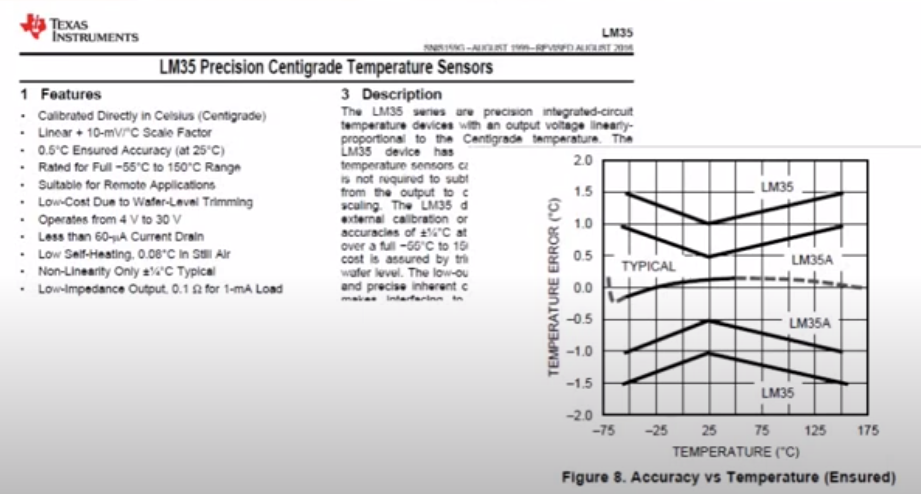

### Sensibilidade
A sensibilidade $S_e$ de um instrumento é a variação do valor da saída em um estado estacionário $q_o$ provocado por uma variação da variável de entrada $q_i$, também em estado estacionário. Temos:

$
    Se = \frac{q_o}{q_i}
$

Se independente de $q_i \rightarrow$ Comportamento estático Linear. 

Se dependente de $q_i \rightarrow$ Comportamento estático não Linear, como é o caso do LM35. 

Dessa forma a sensibilidade será a razão entre a entrada e a saída do sistema:

$
    S_e(q_i) = \frac{dq_o}{dq_i} = lim_{\Delta q_i \rightarrow 0} \left( \frac{\Delta q_o}{\Delta q_i} \right)
$

Entradas de interferência e modificadoras (EI, EM) alteram a sensibilidade $S_e$:

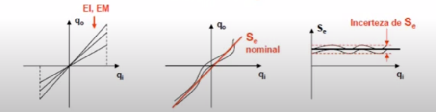

**EXEMPLO:**
Como exemplo podemos ver o sistema de medição de pressão a seguir.

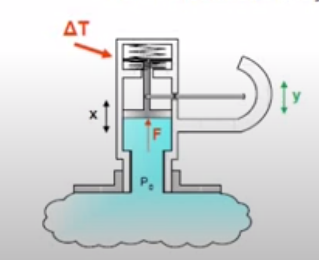

Além da pressão outros fatores causam mudança no valor medido. Neste sensor, temos como entrada a pressão ($P_0$) e como saída a medida dela ($Y$).
Assim temos:

$
    S_e = \frac{y}{P_0} = \frac{a}{bKA}
$

Assim, estudando a influência da variação da temperatura ambiente, podemos observar que ela causa uma dilatação no material tanto da haste de medição quanto na mola. 
Com $P_0 = 0$ podemos ter valores medidos diferentes de zero devido a essa dilatação ($y \neq 0$). Além disso a sensibilidade também é alterada devido à dilatação da alavanca, assim temos $S_e \neq 0$.

Assim será necessário o desenvolvimento de ensaios, de forma que possamos verificar a influência da temperatura no valor medido e na sensibilidade. Assim, mantemos a pressão igual a zero, variamos a temperatura $[T_{max}, T_{min}]$ dentro do intervalo de operação previsto para o equipamento.

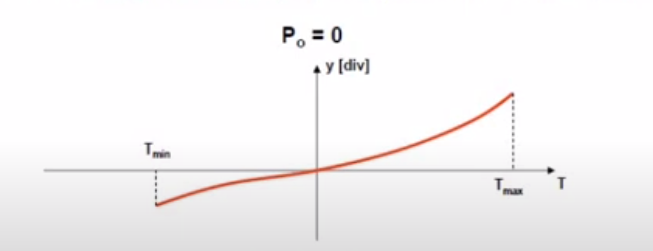

Para corrigir o problema, podemos dividir a escala de acordo com essa variação. E podemos aplicar algoritmos de correção na saída.

Outra coisa que podemos fazer é para cada valor de $P_0$ variar a temperatura, como foi feito no teste anterior. Os ensaios são realizados para cada valor de pressão em uma câmara de temperatura controlada. Isso resultará em famílias de curvas $y(T) = S_e (T) . P_0(T) \rightarrow S_e(T)$. Assim, a sensibilidade nominal pode ser estimada estatisticamente com o intervalo de confiança especificado para o SM.

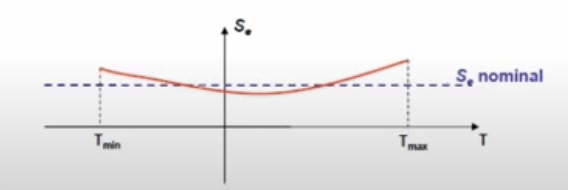

Para que a gente possa trabalhar com sensores no que diz respeito à sensibilidade, temos que conhecer algumas questões operacionais. Entre elas:

- Faixa de operação (range): intervalo definido para o qual o SM mantém suas especificações de funcionamento(sensibilidade estática, linearidade, incertezas, etc...). Se o módulo dos limites do range são iguais eles são denominados fundo de escala ($\pm FS$).

- Resolução: menor variação da entrada($q_i$) capaz de ser observada na saída ($q_o$).

- Um sistema de medição analógico tem teoricamente resolução igual a zero. Porém, interferências (atritos, folgas, induções eletromagnéticas, etc..) tornam a medição imprecisa dependendo da ordem do valor medido.

- Um sistema de medição digital tem resolução finita, correspondente ao mentor incremento digital que o sensor é capaz de externar.

Um Arduino trabalha com 10 bits. Nesse caso as entradas tem resolução de $1/2^{10}$. Se o sensor te temperatura avlia uma faixa de operação de 0 a 100 graus célcios, qual seria a variação de entrada mínima para obter uma alteração da temperatura do sensor? Para obter a resposta, basta dividir o intervalo por 1024 que resulta em $0,097C^o$.

- Faixa linear de operação: É um subintervalo da faixa de operação onde a sensibilidade pode ser admitida constante (um $S_e$ nominal). Tudo isso dentro de uma tolerância admitida nas especificações do SM.

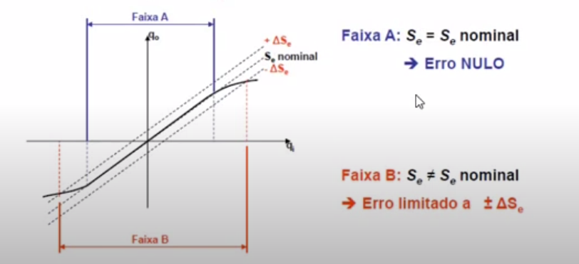

- Não linearidade terminal: Incerteza máxima calculada na faixa de operação do SM. Construímos ela da seguinte forma:

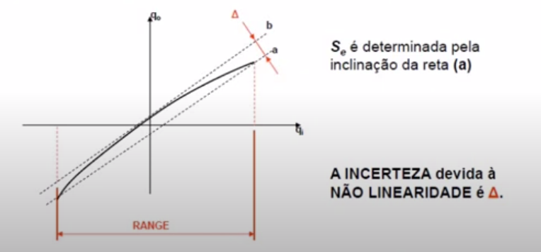

- Não linearidade relativa à reta de regressão: Incerteza máxima calculada na faixa de operação d SM. Construir as retas a e b paralelas à reta de regressão obtida a partir das medições de $q_i$ e $q_o$, passando pelos pontos que resultam o máximo $\Delta$.

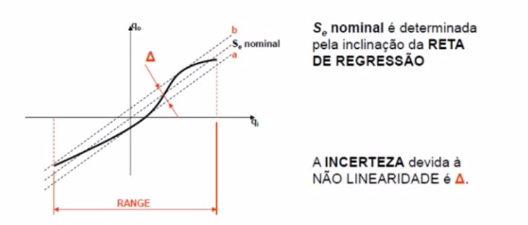

- Incerteza no valor de entrada: É calculado por uma porcentagem do funco de escala e uma porcentagem do valor de entrada. Usa-se o valor da incerteza que for maior para cada valor de $q_i$ no range do sistema de medição. Alguns sistemas de medição comerciais utilizam a especificação da incerteza por uma superposição dos dois critérios:

$
    \Delta (q_i) = B\% FS \pm A\% q_i
$

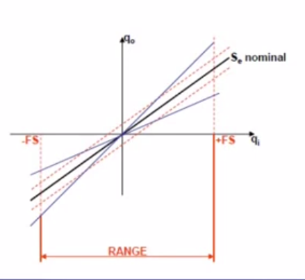

- A resolução do sistema de medição pode ter valores diferentes para cada nível da entrada ($R = R(q_i)$). Esta característica é determinada em ensaios realizados fixando valores de $q_i$ e aplicando variações $\Delta q_i$. O menor valor de $\Delta q_i$ que gera $\Delta q_o$ é a resolução. Alguns fabricantes fornecem o valor da resolução expresso em porcentagem do fundo de escala ($\% FS$). EXEMPLO: Célula de carga de FS = 500N com resolução melhor que 1\% de FS $\rightarrow$ a resolução é igual a 5 N.

- A incerteza de um sistema de medição expressa os limites do intervalo de confiança (95%) para a medida indicada. O valor depende do fundo de escala e das características construtivas do SM. EXEMPLO: Voltímetro HP 3456A de 6 DÍGITOS: para FS = 1 V, a incerteza = $\pm 0.0012\%$ da leitura + 5 contagens (do LSD = sexto dígito) $\rightarrow$ Até 1V DC: I = 0.000012 V + 0.000005 = 0.000017 V.

- LIMIAR (threshold): Menor valor de $q_i$ a partir do zero que ode ser detectado na saída do SM. Este é o valor da RESOLUÇÃO para $q_i = 0$. Limiar é uma resolução específica.

- HISTERESE: Diferença entre a saída $q_o$ do SM para cada entrada $q_i$ quando esta é atingida de forma crescente ou decrescente. Esta característica produz uma incerteza no valor de $q_o$, sendo provocadas por deformações, atritos viscosos e secos, amortecimento interno ou propriedades elétricas e magnéticas dos componentes do SM.

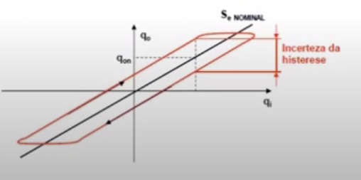

Trabalharemos com histerese no módulo 5, com taco geradores. E também com módulo 7 com o potenciômetro.

## Calibração estática
Procedimento experimental para determinar a função de transferência efetiva do SM, comparando a medida $q_o$ com os valores padrões da entrada $q_i$. Os resultados obtidos permitem determinar $S_e$.

Esta operação é realizada nas seguintes situações:

- Quando um novo SM é projetado.
- Em intervalos de tempo regulares para garantir que o SM está operando dentro de suas especificações. O intervalo de temo entre calibrações é estabelecido por norma técnica específica para cada categoria do SM, sendo em média igual a 1 ano.
- Para verificação de erros sistemáticos ou aleatórios antes de usar o SM num experimento.

Podemos fazer esse processo colocando padrões da grandeza física na entrada do SM.

Os padrões devem ter incertezas pelo menos 5 vezes menores que a desejada no SM. 

Outra forma é usar um sistema de medição padrão (SMP) cujas saídas são comparadas com o SM analisado quando submetida a mesma entrada de forma simultânea. Mais uma vez, o SMP deve ter incertezas pelo menos 5 vezes menores que a desejada para o SM analisado.

Quanto ao procedimento nós precisamos ter:

- Espaçamento entre as medidas: Caso o SM tenha comportamento linear, o intervalo de entrada ($\pm FS$) deve ser dividido em subintervalos iguais. O número de subintervalos é determinado por um critério estatístico (mínimo de 10). Caso o comportamento seja não linear o tamanho dos subintervalos pode ser variável, sendo menor na faixa em que o gradiente ($\frac{d q_o}{d q_i}$) é mais elevado.

- Número de medidas por entrada: O número de experimentos deve ser definido em função da característica estatística dos dados para determinar o intervalo de confiança com o nível de probabilidade desejado (a confiança deve ser a mesma para todos os níveis de entrada: 95\% é usual).
- Histerese: as entradas $q_i$ são aplicadas de forma crescente e decrescente e são medidas as saídas $q_o$ para os dois casos.
- Resolução e limiar: para cada valor de entrada determinar o menor valor de entrada capaz de produzir variação na saída. Estes ensaios devem ser realizados após a obtenção da função de transferência do SM.

Existem várias etapas de análise, como a definição do objetivo do estudo, identificação do sistema de medição, seleção dos padrões, preparação do experimento, execução do ensaio, processamento e análise dos resultados e relatório técnico. Vamos focar no processamento e na análise dos dados uma vez que estamos tendo somente aulas remotas.

**EXEMPLO**: Calibração de uma célula de carga KRATOS

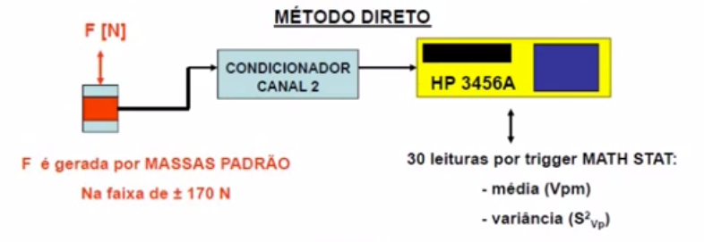

Dentre os procedimentos, temos:

- Tipos de ensaios: compressão, tração em carga e descarga
- Seleção das massas padrão (Kg), (incerteza de $\pm$ 1 grama)
    - para o ensaio de compressão: mc = [0.996, 1.092, 3.062, 6.480, 11.442, 16.478]
    - para o ensaio de tração: mt = [0.594, 1.578, 2.564, 4.544, 7.062, 12.024, 17.060]

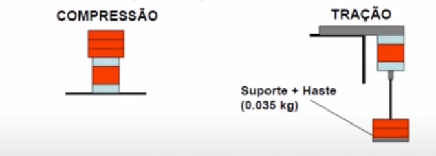

Os ensaios são realizados com adição e retirada das massa. Temos então vetores que representam a sequência de colocação das massas, resultando nas forças padrão aplicadas:

Fpc = [-9.7708, -19.4434, -38.8672, -63.5688, -112.2460, -161.6492] [N]

Fpt = [5.8271, 15.4802, 25.1528, 44.5766, 69.2782, 117.9554, 167.3586] [N]

Temos 30 leituras de cada carga colocada. Temos então a média de compressão a tração na carga e na descarga. Intervalos com 95\% de intervalo de confiança. Assim, seguem os resultados:

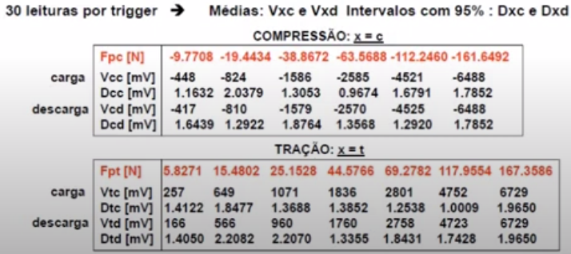

Agora podemos fazer a análise dos resultados. Para isso fazemos uma regressão linear com uma função especial do Matlab que já fornece tudo para nós. Ele nos dá o OFFSET e a sensibilidade estática, os intervalos de confiança e os resíduos em cada valor de força.

