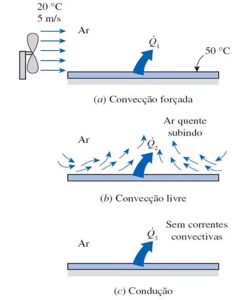
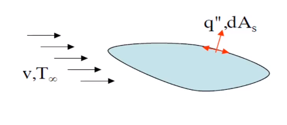
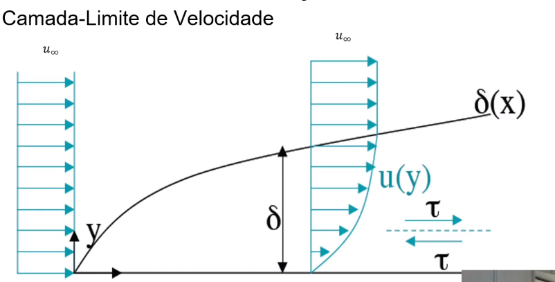
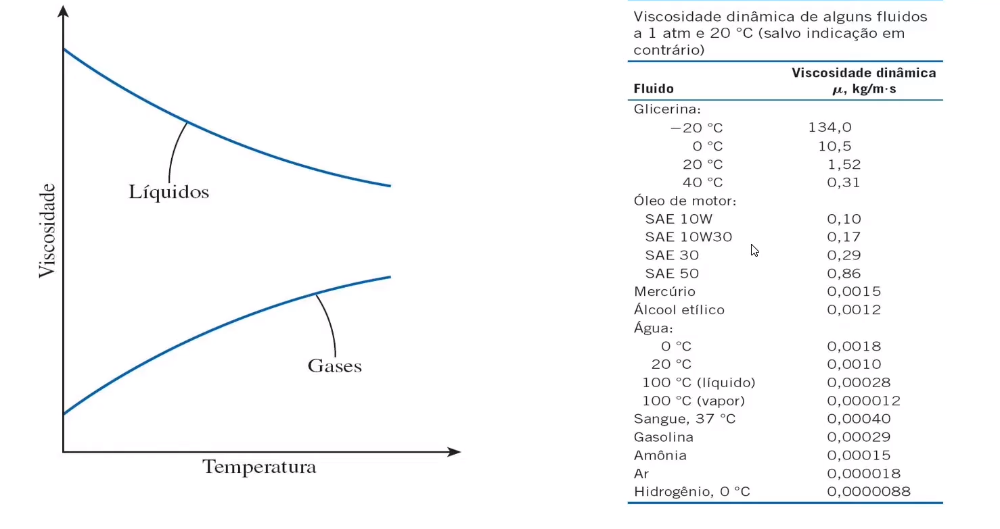
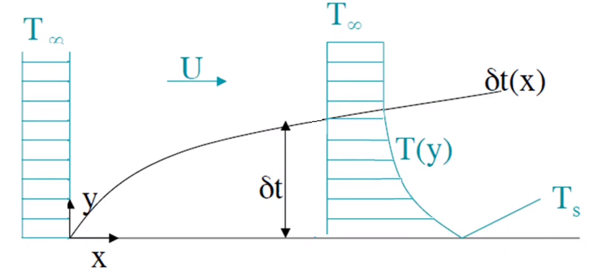
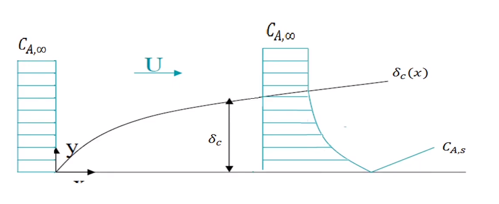

# Introdução a convecção térmica
Veremos a introdução ao fenômeno da convecção térmica. Veremos como e porquê ele ocorre e suas consequências.

Podemos ver um ventilador empurrando o ar de encontro a uma parede aquecida (temperatura maior que a do ar incidente). O ar retirará energia térmica da superfície. Quanto menor a temperatura do fluido ou maior o fluxo de ar mais energia será retirada da placa mais rápido pelo ar passante. Isso é chamado de convecção forçada.

Em um outro caso, temos novamente uma placa aquecida em contato com ar relativamente frio. A medida que o ar frio se aproxima da placa e entra em contato com ela, ele recebe energia da placa se aquecendo. O ar, sendo um gás perfeito, tem sua massa específica diminuída o que causa sua ascensão. A subida desse ar abre espaço para mais ar quente se aproximar da placa. Isso causa um ciclo que podemos chamar de convecção natural onde a própria variação de temperatura causa movimento no fluido.

Por último temos ar parado, ou seja, sem o fenômeno da convecção. Ou seja, temos a placa aquecida e o ar estático em cima o que resulta em calor somente por condução. Essa situação não é puramente teórica, pois isso ocorre onde não há espaço para o ar circular no movimento convectivo. Como no caso em que há duas placas de vidro próximas um da outra com ar entre as duas.

Um exemplo do dia a dia é quando sopramos uma colher de sopa quente para esfriá-la. Isso é um clássico caso de convecção forçada.

## Definição formal da convecção:
Convecção é a transferência de energia que ocorre entre uma superfície e um fluido em movimento, devido ao movimento deste fluido. A energia pode migrar nos dois sentidos, indo do fluido à superfície. A convecção ocorre divido à advecção. O termo responsável pela movimentação do fluido é o termo advectivo ele se refere ao transporte de energia via transporte de massa. Assim temos a convecção dividida em duas formas de transferência de energia: Condução mais advecção, onde a advecção se relaciona com a transferência de massa enquanto a condução se relaciona com o trasporte de energia que ocorre sem movimentação de massa.

## As camadas limite da convecção
Este fenômeno é governado por algo que ocorre na fronteiro entre o sólido e o fluido. Toda essa transferência depende dessa região de contato. Vale a pena lembrar algumas coisas sobre esse tópico.

Podemos ver que em $y = 0$ a velocidade é nula. Ou seja, o fluido que toca a placa está parado. Este elemento de volume de fluido afeta um outro elemento a partir de forças viscosas cisalhantes que afeta fluido que corre na direção paralela à placa. Essa força é proporcional à diferença de velocidade entre os dois elementos de fluido. Conforme nos afastamos da placa a velocidade do elemento de volume aproxima-se de $u_\infty$ e o gradiente diminui, tendendo a zero no fim da camada limite. O ponto de maior gradiente de velocidade é o ponto de contato com o meio sólido e consequentemente esse é o ponto de maior força cisalhante.

Outra coisa que podemos observar é que ela evole conforme o escoamento avança sobre a superfície. E é importante frisar que esta curva representa um escoamento laminar. Tal organização, com movimentação de fluido somente paralela à placa sólida depende dessa hipótese. Com escoamentos turbulentos as forças inerciais criam padrões caóticos e desordenados de movimentação em todas as direções.

As camadas limite da convecção fornecem a base para o coeficiente de atrito local $C_f$ que é um parâmetro adimensional chave para a determinação do arrasto:

$
    C_f = \frac{\tau_s}{\rho u_\infty^2/2}
$

A tensão cisalhante na superfície do sólido pode ser vista adiante:

$
    \tau_s = \mu \frac{\partial u}{\partial y} |_{y=0}
$

Assim vemos que tanto a velocidade quanto a viscosidade são grandezas muito importantes nessa análise.
É interessante notar que a viscosidade de varia com a temperatura. Isso pode ser visto adiante:

Além da camada limite de velocidade também temos a camada limite térmica. Ela, assim como a velocidade, abrange a área de transição entre o meio fluido em certa temperatura e o meio sólido em outra. Seu comportamento é parecido com a da velocidade. Temos também um $T_\infty$ global do fluido e a temperatura do fluido em contato direto com a placa também é igual à temperatura dela.

Neste caso, para determinar o tamanho da camada limite térmica usamos da seguinte expressão:

$
    \frac{\theta}{\theta_s} = \frac{T_s - T(y)}{T_s - T_\infty} = 0.99
$

O gradiente de temperatura também cria um fluxo térmico, da mesma forma como o gradiente de velocidade cria a força viscosa. Para qualquer distância x da aresta frontal, o floxo térmico na superfície local pode ser obtido pela lei de Fourier no fluido em $y = 0$.

$
    q_s^{\prime\prime} = -k_f \frac{\partial T}{\partial y}|_{y=0}
$

A partir da lei de resfriamento de Newton podemos dizer que:

$
    q_s^{\prime\prime} = h (T_s - T_\infty)
$

Onde h é um coeficiente chamado de coeficiente de convecção que engloba todos os efeitos da camada limite.
Um dos objetivos dessa disciplina é determinar essa constante:

$
    h = \frac{- k_f \frac{\partial T}{\partial y}|_{y = 0}}{T_s - T_\infty} 
$

Onde $k_f$ é o coeficiente de condução térmica do fluido. As propriedades do material sólido não entram nesse tipo de estudo.

Também temos a camada limite de concentração que estabelece a presença de certa substância no fluido. Um exemplo é quando você passa perfume, onde sua pele começa a emitir essas partículas com cheiro e a forma como se passa esses componente está descrito adiante.

Ainda temos uma camada limite com espessura que pode ser determinada de forma similar a da camada limite térmica.

$
    \frac{C_{A,s} - C_A(y)}{C_{A,s} - C_{A,\infty}} = 0.99
$

Também podemos ver como as equações são similares, a partir da lei de Fick:

$
    N_A^{\prime\prime} = -D_{AB} \frac{\partial C}{\partial y}|_{y=0}
$

Assim, analogamente à lei de resfriamento de Newton:

$
    N_A^{\prime\prime} = h_m (C_{A,s} - C_{A,\infty})
$

$
    h_m = \frac{- D_{AB} \frac{\partial C_A}{\partial y}|_{y = 0}}{C_{A,s} - C_{A,\infty}} 
$

Podemos dizer que a camada limite hidrodinâmica existe em qualquer escoamento sobre qualquer superfície. Grandes gradientes de velocidade causam grandes tensões cisalhantes.

A camada limite térmica existirá sempre que houver uma diferença de temperatura entre o fluido e a superfície sólida. Isso estabelece um gradiente de temperatura que resulta em calor.
